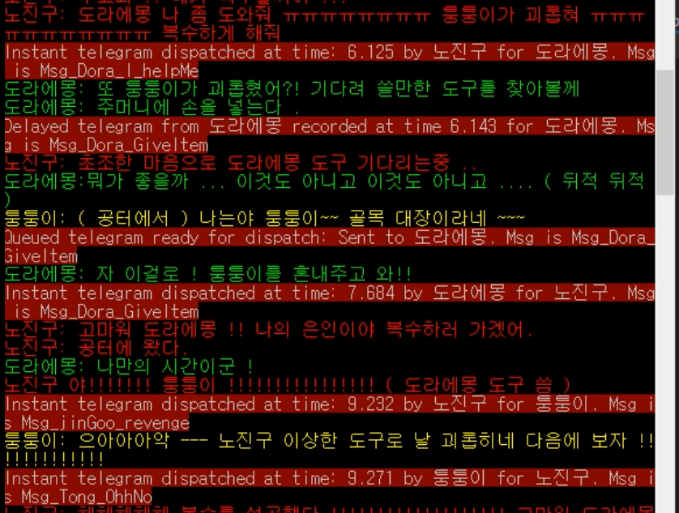

# FSM

개발: AI, C++, FSM
업무포지션: 프로그래밍 

## 👩‍🏫PROJECT 소개

FSM 를 이용한 AI 에이전트 설계 학습

👨‍💻 **투입인원** : 1인개발

📒 **주요 성과** 

- 교재 [Programming Game AI by Example], (Mat Buckland) 의 예제 소스를 이해
- 에이전트 새로운 상황 구현

🌱 **스킬 및 사용툴**

 `C++` `visualStudio` 

## 🖌️더 알아보기

### 플레이 영상

[https://www.youtube.com/watch?v=HT-8v1VISMA](https://www.youtube.com/watch?v=HT-8v1VISMA)